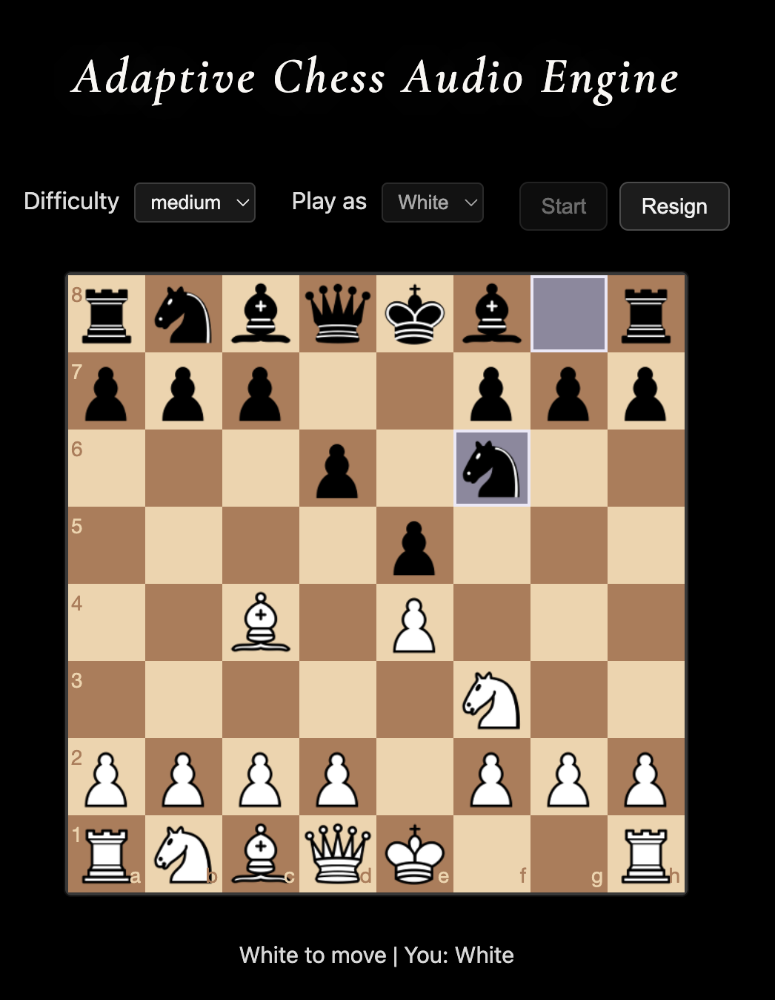
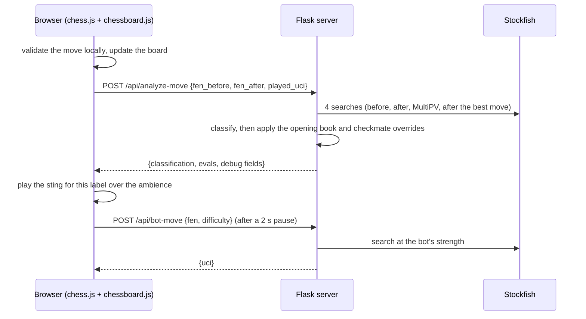

# Adaptive Chess Audio Engine

Play chess against Stockfish in the browser. The soundtrack reacts to the quality of every move you make.



> **Demo video (with sound):** _coming soon._ The audio is the point of this project, and a screenshot can't carry it.
> Until the video exists, see [Listening to the sounds](#listening-to-the-sounds).

## What it is and why

After each of your moves, the server asks Stockfish how much that move changed the evaluation. It then labels the move the way chess sites do: `best`, `great`, `excellent`, `good`, `inaccuracy`, `mistake`, `blunder`, plus `book` for known opening theory and `checkmate`. The browser answers with a sound composed for that label, layered over an ambient bed. A clean move gets a small, satisfying cue. A blunder gets something you feel. Getting mated fades the ambience out before a dramatic sting.

Chess sites show these judgements as icons after the game is over. Hearing them live changes how a game feels: you know a move was bad before you have worked out why. There are three sound packs, one per bot difficulty:

- **Easy** plays soft Web Audio sine tones for each label.
- **Medium** and **Hard** play composed WAV stings, with a separate mix for each pack.

## Quick start

You need Python 3.9 or newer and a Stockfish binary.

```bash
# 1. Install Stockfish (any recent version; developed against Stockfish 18)
brew install stockfish            # macOS
# sudo apt install stockfish      # Debian/Ubuntu
# or download from https://stockfishchess.org/download/

# 2. Install and run
git clone <this repo> && cd ChessMusic
python3 -m venv .venv && source .venv/bin/activate
pip install -r requirements.txt
python -m chess_audio
```

Open <http://127.0.0.1:5001>, pick a difficulty and a color, and press **Start**. Headphones help.

If Stockfish is not on your `PATH`, point the app at it with `STOCKFISH_PATH=/path/to/stockfish python -m chess_audio`. [`.env.example`](.env.example) lists every setting (port, search depth, number of lines, opening book path, game-phase thresholds). Copy it to `.env` and use [`scripts/restart_server.sh`](scripts/restart_server.sh), which loads `.env`, stops whatever is already listening on the port, and starts the server.

### Tests

```bash
pip install -r requirements-dev.txt
python -m pytest
```

The suite runs against a deterministic fake engine, so it needs no Stockfish. If a real Stockfish binary is found, four extra smoke tests also run against it.

## How it works

### One move, end to end



The server keeps no game state. The browser owns the game (chess.js checks legality and detects game over) and sends FENs with every request.

### Classification

The core classifier is a port of [Eye on Chess](https://github.com/amiwrpremium/eye-on-chess)'s `classify.ts`. It measures **centipawn loss**: how much the evaluation got worse, from the mover's side, between the position before the move and the position after it.

| Label | Rule |
|---|---|
| `best` | The only legal move, or the same move as Stockfish's top line |
| `great` | Loss of 5 cp or less, or a "brilliant" sacrifice (you give up material and the engine's second-best line is much worse) |
| `excellent` | Loss of 25 cp or less |
| `good` | Loss of 50 cp or less |
| `inaccuracy` | Loss of 100 cp or less |
| `mistake` | Loss of 200 cp or less |
| `blunder` | Loss of more than 200 cp |

Two overrides are applied on top:

- **`checkmate`**: the move delivers mate. This beats everything else.
- **`book`**: the game is still in the opening phase and the move is in the bundled Polyglot opening book ([`data/gm2001.bin`](data/gm2001.bin)). The phase comes from a material-and-development heuristic in [`game_phase.py`](chess_audio/game_phase.py).

Only your moves are classified. When the bot mates you, the browser plays the mate-loss sting instead.

### Bot strength

| Level | Stockfish settings | Search limit |
|---|---|---|
| Easy | Skill Level 3 | depth 4 / 0.12 s |
| Medium | Skill Level 10 | depth 9 / 0.18 s |
| Hard | `UCI_Elo` 1800, Skill Level 12 | depth 12 / 0.22 s |

Move analysis always runs at full strength (depth 12, 10 principal lines), whatever the bot level.

### Code map

```
chess_audio/
  __main__.py        entry point: python -m chess_audio
  app.py             Flask routes, request validation, JSON errors
  engine.py          the shared Stockfish process and evaluation helpers
  move_classifier.py Eye on Chess port: centipawn loss, thresholds, sacrifice heuristic
  game_phase.py      opening / middlegame / endgame detection
  opening_book.py    Polyglot book lookup
  bot_levels.py      easy / medium / hard engine presets
  config.py          settings, all overridable by environment variable
static/js/
  main.js            game controller: board, turns, controls, status line
  api.js             fetch wrappers for the two endpoints the UI uses
  audio.js           sound packs, mixing, fades, synth fallback
static/audio/        easy/, medium/, hard/ packs and shared/ stings
templates/index.html the single page
tests/               API characterization tests and unit tests
```

### API

All endpoints take and return JSON. Errors come back as `{"error": "..."}` with a 4xx or 5xx status.

| Endpoint | Body | Returns |
|---|---|---|
| `POST /api/analyze-move` | `fen_before`, `fen_after`, `played_uci` (optional; inferred from the two positions if missing) | `classification`, plus evaluations, centipawn loss, top engine moves, game phase, book and mate details |
| `POST /api/bot-move` | `fen`, `difficulty` (`easy` / `medium` / `hard`) | `uci`, `difficulty`, `bot_level` |
| `POST /api/evaluate` | `fen` | `eval_cp` (White's point of view), `mate`, `mate_in` |

## Technical decisions and tradeoffs

**One Stockfish process, behind a lock.** A single engine is started on the first request and shared by every endpoint, and a `threading.Lock` serializes access. Starting Stockfish per request would add latency to every move. A pool would be overkill for a single-player local app. The cost is that concurrent requests queue behind each other. That is fine here, but it would not scale to many users.

**The bot and the analysis share that engine.** A bot move weakens the engine and then always restores full strength in a `finally` block, so a bot request can never leave the analysis running at bot strength. The price is two extra `configure` calls per bot move, which is negligible.

**Skill Level instead of `UCI_Elo` for Easy and Medium.** The obvious way to weaken Stockfish is `UCI_Elo`, but Stockfish 18 rejects any value below 1320, and 1320 is too strong for "easy". Easy and Medium therefore combine Skill Level with a shallow search. Hard uses `UCI_Elo`, and every value is clamped to the ranges the running engine reports, so a different Stockfish build can't make `configure` fail.

**Comparing evaluations before and after the move.** The classifier compares the evaluation before your move with the evaluation after it. Another approach compares your move's resulting position against the position after the engine's best move. The server computes that second number as well (`cp_loss_vs_best`) and returns it in the response, but the label comes from Eye on Chess's method, so results match a known reference implementation.

**Four engine searches per move, at depth 12.** Each move analysis runs four searches: the position before, the position after, one MultiPV search for the top lines (which also supplies the second-best line for the sacrifice check), and the position after the best move. Depth 12 keeps the round trip short enough that the sound lands while the move still feels fresh. Deeper searches would label close calls more accurately, but the sound would arrive noticeably late. Depth and line count are both configurable.

**No frontend build step.** The UI is three native ES modules. chess.js, chessboard.js and jQuery load from CDNs. Cloning and running needs nothing but Python. The tradeoffs are no bundling, no type checking, and a dependency on CDN availability.

**HTMLAudio for files, Web Audio for synthesis.** Each sting is its own `Audio` element, so stings can overlap each other and the ambience. `HTMLAudioElement` has no scheduled volume automation, so fades step the volume on a timer. If a file fails to load, a Web Audio sine tone plays instead, so a move never goes silent. Audio URLs carry a version query string (`AUDIO_CACHE_VERSION` in `audio.js`), so browsers pick up re-exported sounds instead of serving stale cached ones.

**MP3 ambience, WAV stings.** The ambience beds are five-minute loops, so they are MP3s at 160 kbps (about 6 MB each, instead of about 50 MB as WAV). The stings are short and timing-sensitive, so they stay WAV. MP3 encoders pad the start and end of a file, so there can be a tiny gap where the bed loops.

**Tests before refactoring.** Characterization tests pin the exact JSON shape and values of every endpoint, using a fake engine with scripted evaluations. They were written before this codebase was restructured, so the refactor could be checked against them. The real-engine smoke tests catch the things a fake can't, such as option ranges and the MultiPV response format.

## Listening to the sounds

With the server running, open <http://127.0.0.1:5001/static/sound_test.html>. It is a single page with a player for every sound in every pack. It has to be served by the app; opened as a local file, the audio paths won't resolve.

Or browse the files directly:

| Sound | Medium | Hard |
|---|---|---|
| Ambience | [ambience.mp3](static/audio/medium/ambience.mp3) | [ambience.mp3](static/audio/hard/ambience.mp3) |
| `best` | [best.wav](static/audio/medium/best.wav) | [best.wav](static/audio/hard/best.wav) |
| `great` | [great.wav](static/audio/medium/great.wav) | [great.wav](static/audio/hard/great.wav) |
| `excellent` | [excellent.wav](static/audio/medium/excellent.wav) | [excellent.wav](static/audio/hard/excellent.wav) |
| `good` | [good.wav](static/audio/medium/good.wav) | [good.wav](static/audio/hard/good.wav) |
| `book` | [book.wav](static/audio/medium/book.wav) | [book.wav](static/audio/hard/book.wav) |
| `inaccuracy` | [inaccuracy.wav](static/audio/medium/inaccuracy.wav) | [inaccuracy.wav](static/audio/hard/inaccuracy.wav) |
| `mistake` | [mistake.wav](static/audio/medium/mistake.wav) | [mistake.wav](static/audio/hard/mistake.wav) |
| `blunder` | [blunder.wav](static/audio/medium/blunder.wav) | [blunder.wav](static/audio/hard/blunder.wav) |
| You deliver mate | [checkmate_win.wav](static/audio/medium/checkmate_win.wav) | [checkmate_win.wav](static/audio/hard/checkmate_win.wav) |
| You get mated / resign lead-in | [checkmate_loss.wav](static/audio/medium/checkmate_loss.wav) | [checkmate_loss.wav](static/audio/hard/checkmate_loss.wav) |

Easy uses [its own ambience](static/audio/easy/ambience.mp3) and synthesized tones for everything else. Two stings are shared between packs:

- [`shared/resign.wav`](static/audio/shared/resign.wav) plays after the mate-loss lead-in when you resign in Medium or Hard.
- [`shared/checkmate.wav`](static/audio/shared/checkmate.wav) is the fallback if a pack's win sting fails to load.

## Known issues

These are real bugs, left in place on purpose because this pass was cleanup only.

- **Mate evaluations have the wrong sign on the mating move.** When a move delivers checkmate, `eval_after_cp` is always reported as −10000, even when White gave the mate. This affects the numeric debug fields for that move, but not the label, because `checkmate` overrides the classifier.
- **A crashed Stockfish is never restarted.** If the engine process dies, every later request fails with an engine error until the server is restarted.
- **The difficulty can be changed mid-game.** The dropdown stays enabled during a game. Changing it switches the bot strength and the sound pack immediately, but the ambience keeps playing from the old pack until the next game.
- **Some malformed requests return an HTML 500 instead of a JSON 400.** This happens with an unparseable `played_uci`, or a FEN missing its side-to-move field.
- **Analysis failures are silent in the UI.** If `/api/analyze-move` fails, the error only goes to the browser console, and that move gets no sound.

## Credits

- Move classification is ported from [Eye on Chess](https://github.com/amiwrpremium/eye-on-chess) by amiwrpremium.
- The game-phase thresholds follow the rules described by the ailed-chess project.
- [Stockfish](https://stockfishchess.org/) (GPLv3) does the analysis and plays the bot. It is not bundled; you install it separately.
- The frontend uses [chess.js](https://github.com/jhlywa/chess.js) 0.10.3 and [chessboard.js](https://chessboardjs.com/) 1.0.0. The backend uses [python-chess](https://python-chess.readthedocs.io/) and [Flask](https://flask.palletsprojects.com/).
- `data/gm2001.bin` is the gm2001 Polyglot opening book.
